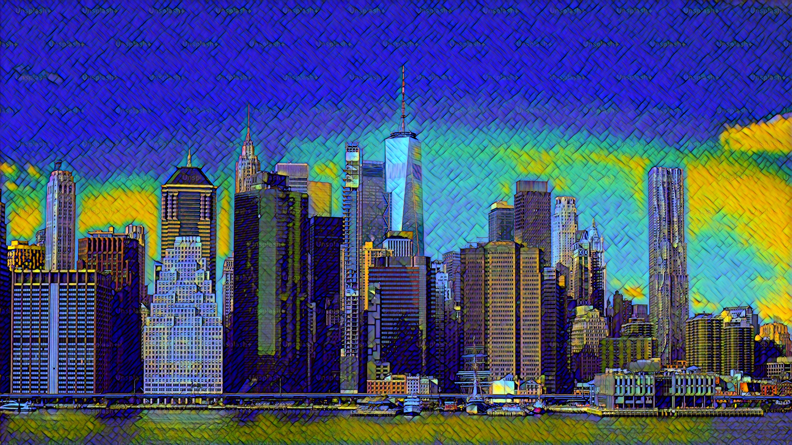

# Neural Style Transfer

Neural Style Transfer (NST) transfers the aesthetic style (brush strokes, textures, colors) of the style image, usually an art work onto the content of another content image. It uses convolutional neural networks. 

This repo implements the fast feed-forward approach (one trained transformer network per style) which is much faster at inference than the original method.

This implementation is based on the paper [Perceptual Losses for Real-Time Style Transfer and Super-Resolution by Johnson et al.](https://arxiv.org/abs/1603.08155) and uses a pre-trained VGG16 network as a perceptual loss function.

## 🖼️ Example

**Style image used**

<p align="left">
  
</p>

**Before / After**

<p align="left">
  
  &nbsp;&nbsp;&nbsp;
  
</p>


> *Training the netork on more images and adjusting the hyperparameters will result in better and more accurate results*

## 🚀 How to Use

We recommend using `uv` package manager for python projects, but feel free to use `pip`.

### Inference only

You can stylize any image using the trained model weights (from `models/`). The style from the image shown in the [example](##-🖼️-Example) above is used.

1. Add the image you want to stylize in `images/` directory.
2. Change the image path (`INFERENCE_IMG_PATH`) in `stylize.py`. (Use the relative path)
3. Run `python stylize.py`. (If using `uv` then run `uv run stylize.py` instead.)

*Alternatively you can run the `stylize.ipynb` (from `notebooks/`) on Kaggle or Google Colab. Further instructions are given in the notebook itself.*

### Training 

**NOTE:** These steps are for training on Kaggle with a GPU enabled using the `neural-style-transfer.ipynb` notebook from (`notebooks/`).

1. Upload the `neural-style-transfer.ipynb` notebook to Kaggle.
2. Enable a GPU accelerator. (Settings > accelerator > P100)
3. Mount/add the COCO2017 dataset in the notebook environment.
4. Upload the style image you want.
5. Change the global config paths accordingly.
6. Run the whole notebook.


## 📊 Dataset

This model is trained on the **COCO 2017 (train2017)** dataset. As defined in `config.py`, the training is limited to the first `20000` images to speed up the process on platforms like Kaggle.

For higher-quality results, you can increase `NUM_IMAGES` in `config.py` to use more of the dataset (e.g. 40000 or more).

## 🔎 How Neural Style Transfer works

1. Original paper (Gatyes et al, 2015)

    Original method: start from random/noisy image and iteratively optimize pixel values so that the generated image's feature maps (from a pretrained CNN) match the content features of the content image and the Gram matrix / correlations of the style image. Very flexible (any style) but slow because optimization runs per-output image.

2. Perceptual losses & fast feed-forward (Johnson et al., 2016)

    Instead of optimizing pixels, train a feed-forward image transformation network (TransformerNet) that maps content images => stylized images. Use perceptual/content/style losses computed using a pretrained VGG network (the same feature-based losses as Gatys). After training, stylization is a single forward pass > real-time / fast. This repo implements that single-style feed-forward approach.

3. Universal / Arbitrary style transfer

    Later work explored transferring arbitrary styles without per-style training using feature transforms, adaptive instance normalization (AdaIN), or image translation methods, these allow one network to stylize with many styles at runtime.

✨ **Key building blocks used in this repo:**

- Transformer feed-forward network (Conv > Residuals > Deconv). 
- VGG feature extractor (frozen) to compute content & style representations. 
- Gram matrix for style representation.

## 📁 Project Structure

```
.
├── config.py           # Global configuration (paths, hyperparameters, device)
├── dataset.py          # Defines the COCODataset class and DataLoader
├── transformers.py     # Defines the TransformerNetwork (generator) and VGG16 (loss)
├── train.py            # Main training script to run
├── stylize.py          # Inference script to stylize a single image with a trained model
├── utils.py            # Helper functions (Gram matrix, saving checkpoints)
|
├── notebooks/
│   ├── neural-style-transfer.ipynb     # All-in-one notebook for training on Kaggle
|   └── stylize.ipynb                   # Inference only notebook
|
├── images/
│   ├── style_image.jpg     # The style image on which the model is trained on
│   └── city_photo.jpg      # (Example) A content image for inference
|
└── models/
    └── transformer_weight_final.pth    # Final trained model weights are saved here
```

## 📚 References

- [Gatys et al., 2015] [A Neural Algorithm of Artistic Style](https://arxiv.org/abs/1508.06576) (The original optimization-based paper)
- [Johnson et al., 2016] [Perceptual Losses for Real-Time Style Transfer and Super-Resolution](https://arxiv.org/abs/1603.08155)(The fast, feed-forward method used in this repo)
- [Johnson et al., 2016 - Supp.] [Supplementary Material](https://cs.stanford.edu/people/jcjohns/papers/fast-style/fast-style-supp.pdf) (Helpful architecture details)
- [Ulyanov et al., 2016] [Instance Normalization: The Missing Ingredient for Fast Stylization](https://arxiv.org/abs/1607.08022) (Key paper explaining why Instance Norm, used in transformers.py, works so well for style transfer)